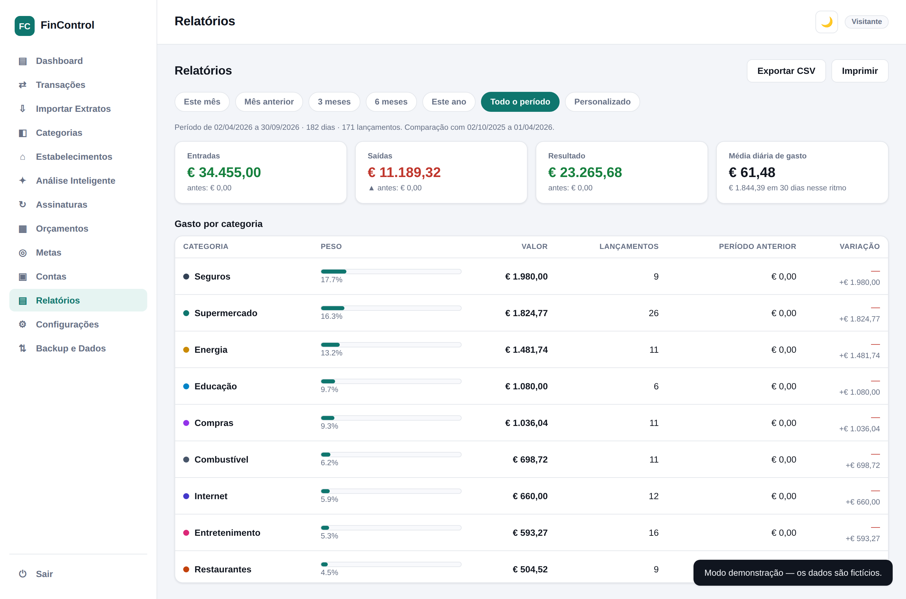
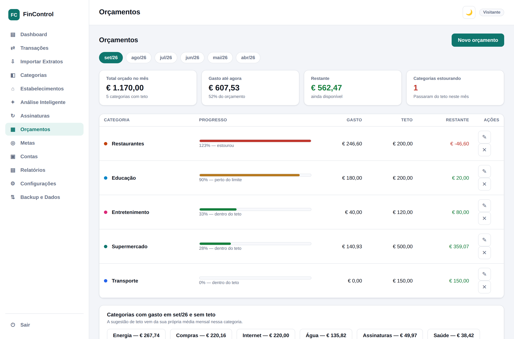
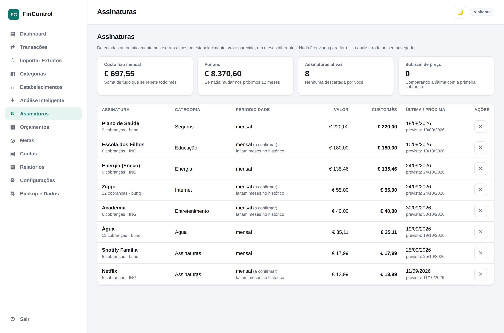
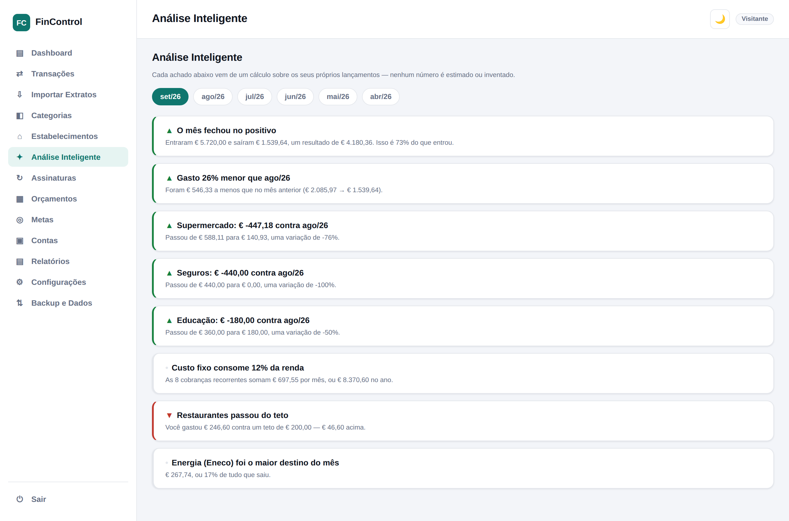
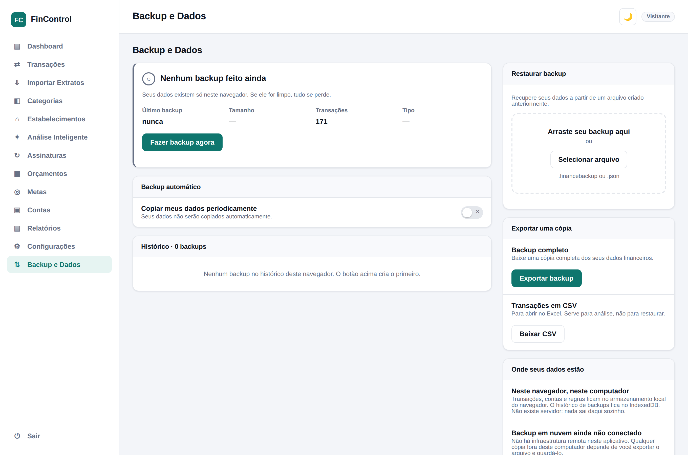
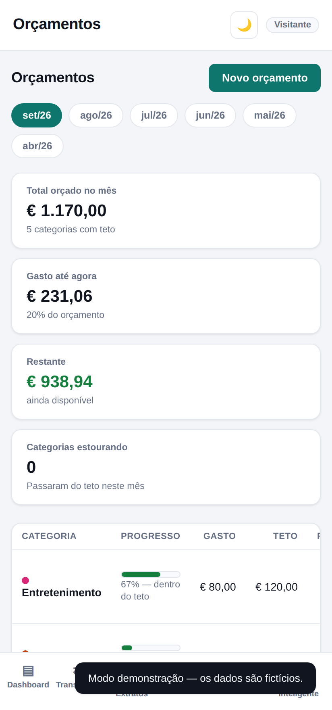

# FinControl

Dashboard financeiro familiar que lê extratos de bancos holandeses (ING e bunq),
categoriza os lançamentos sozinho e transforma isso em análise acionável.

**[▶ Testar a demonstração](https://caiocingles.github.io/fincontrol/)** — clique em
*Entrar no modo demonstração*, sem cadastro. Os dados são fictícios.



---

## O problema

Uma família de cinco pessoas na Holanda, com contas em dois bancos. Todo mês, dois
extratos em CSV, centenas de linhas em holandês, e nenhuma resposta óbvia para
"para onde foi o dinheiro". As planilhas resolviam mal: transferir dinheiro entre as
próprias contas contava duas vezes, e categorizar manualmente 200 linhas por mês não
se sustenta.

O FinControl importa esses extratos e responde essas perguntas sem que nada saia do
navegador.

## O que ele faz

**Importa extratos de verdade.** ING (holandês *e* inglês — são formatos diferentes) e
bunq, em CSV ou XLSX. Detecta o banco pelo cabeçalho, converte valores no formato
europeu e reconhece lançamentos repetidos entre importações.

**Categoriza sozinho.** Cerca de 80 regras cobrindo comércio holandês — supermercados,
seguradoras, transporte público, impostos, *toeslagen*. Nos extratos usados no
desenvolvimento, **97% dos lançamentos foram categorizados sem intervenção**. O que
sobra, você categoriza uma vez e o app aprende para as próximas.

**Reconhece transferências entre as suas contas.** Este foi o problema que motivou o
projeto. Mover dinheiro do ING para o bunq aparece como saída em um extrato e entrada
no outro — somar os dois infla receita e despesa. O app registra o IBAN de cada extrato
importado (guardado mascarado) e cruza com a contraparte de cada lançamento. Também
reconhece pelo texto os casos sem contraparte, como a poupança do ING, que aparece
sozinha. Nos dados reais, isso removeu **€ 3.154 de receita fantasma** de um único
trimestre.

**Detecta assinaturas.** Mesmo estabelecimento, valor parecido, meses diferentes. Mostra
o custo fixo mensal, a projeção anual e avisa quando uma cobrança sobe de preço.

**Analisa o período.** Pontos críticos, onde dá para cortar (só o que é cortável de
verdade — aluguel e seguro ficam de fora) e **a melhor janela para débitos automáticos**,
calculada a partir do seu ciclo real: em que dia a renda cai, em que dia o caixa afunda,
e quais cobranças acontecem antes do dinheiro entrar.

**Backup com integridade.** Exportação em arquivo `.financebackup`, histórico em
IndexedDB, hash SHA-256 para detectar arquivo alterado, cópia de segurança automática
antes de qualquer restauração e opção de desfazer.

## Telas

| | |
|---|---|
|  |  |
| **Orçamentos** — teto por categoria, com sugestão baseada na sua própria média | **Assinaturas** — cobranças recorrentes detectadas nos extratos |
|  |  |
| **Análise Inteligente** — achados calculados, cada um com o número que o sustenta | **Backup** — integridade verificável e restauração reversível |



## Decisões técnicas

**Arquivo único, zero dependências de build.** Todo o app é um `index.html`. Baixou,
abriu, funciona — sem `npm install`, sem bundler, sem servidor. Para uma ferramenta
doméstica que precisa durar anos sem manutenção de cadeia de dependências, isso vale
mais do que a organização em módulos. As únicas bibliotecas externas são Chart.js,
PapaParse e SheetJS, via CDN.

**Nada sai do navegador.** Sem backend, sem telemetria, sem conta em servidor. Dados
financeiros da família ficam em `localStorage`; o histórico de backups vai para
IndexedDB, porque arquivos de centenas de KB disputariam cota com os próprios dados.
IBAN completo nunca é exibido nem armazenado — só a forma mascarada.

**A IA narra, não calcula.** A integração opcional com a Groq recebe apenas os números
já agregados e escreve a interpretação em texto. Nenhuma transação individual é enviada.
O *system prompt* proíbe inventar valores. Isso elimina a classe inteira de erro em que
um modelo alucina um número financeiro — e deixa a análise funcionando sem chave
nenhuma. A chave fica no `localStorage` do navegador, nunca no arquivo.

**Honestidade na interface.** O app não diz "seus dados estão seguros" só porque estão
no navegador. Não existe "backup na nuvem" porque não existe nuvem. O backup automático
explica que só roda com o app aberto, porque é a verdade. Os níveis de acesso da família
avisam, na própria tela, que organizam mas não protegem.

## Limitações conhecidas

- **Não é multiusuário real.** A autenticação é local; níveis de acesso organizam a
  interface, não protegem os dados. Quem tiver o computador desbloqueado lê tudo.
- **O backup não é criptografado.** O formato já carrega o campo `encrypted: false` e a
  arquitetura está preparada para Web Crypto, mas não finge o que não faz.
- **Backup automático não roda com o app fechado.** Sem service worker, a verificação
  acontece na abertura.
- **Importação de PDF não é suportada** — só CSV e XLSX.
- As regras de categorização são voltadas ao mercado holandês.

## Como rodar

```bash
git clone https://github.com/caiocingles/fincontrol.git
cd fincontrol
# abra index.html no navegador — é só isso
```

Para usar a integração opcional com a Groq, sirva por HTTP em vez de abrir o arquivo
direto (a API recusa requisições de origem `file://`):

```bash
python -m http.server 8000
# http://localhost:8000
```

## Stack

JavaScript puro (ES2020+), CSS com custom properties, HTML semântico.
Chart.js para gráficos, PapaParse para CSV, SheetJS para XLSX, Web Crypto para
hashes, IndexedDB para o histórico de backups.

Sem framework, sem transpilação, sem etapa de build.

## Acessibilidade

Navegação completa por teclado com foco visível, `role` e `aria-*` nos componentes
interativos, estados indicados por forma além de cor, alvos de toque de 44px ou mais,
e layout sem rolagem horizontal a partir de 390px de largura.

## Licença

MIT — veja [LICENSE](LICENSE).
